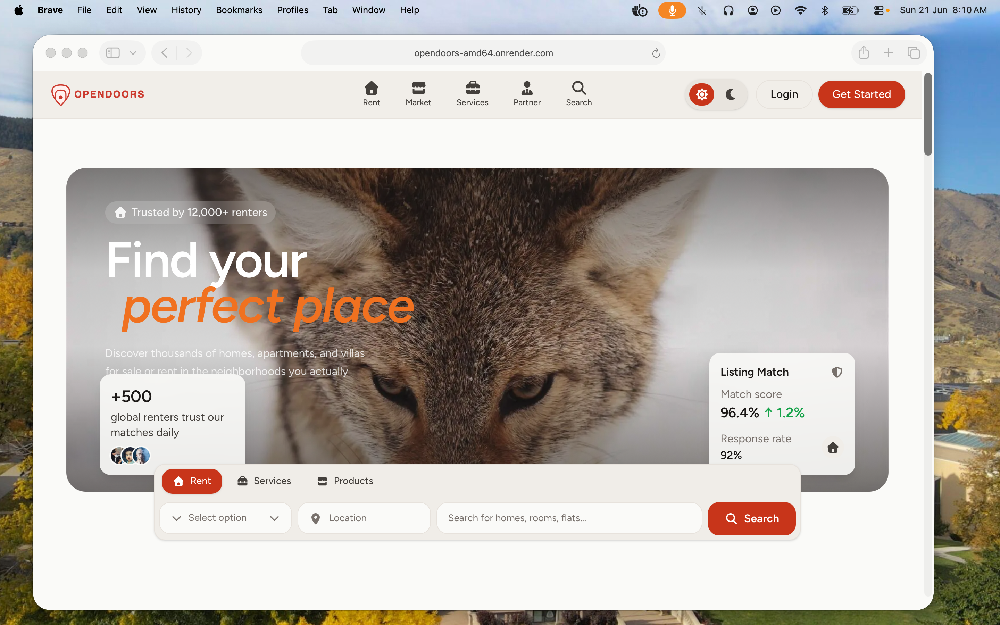
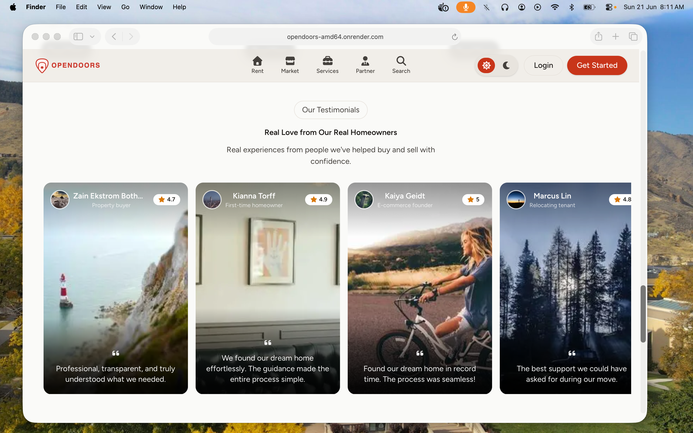
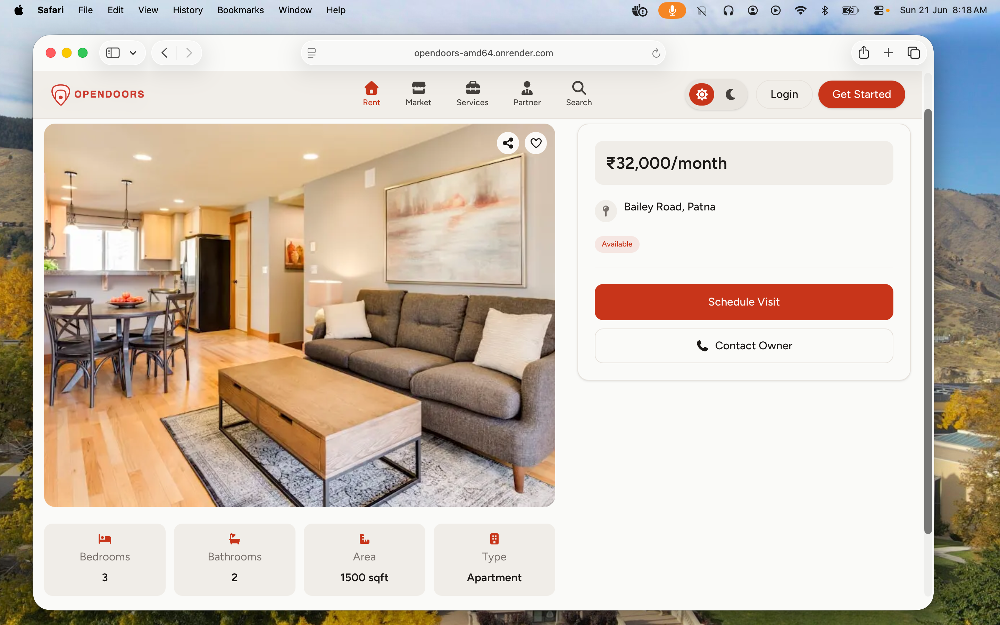
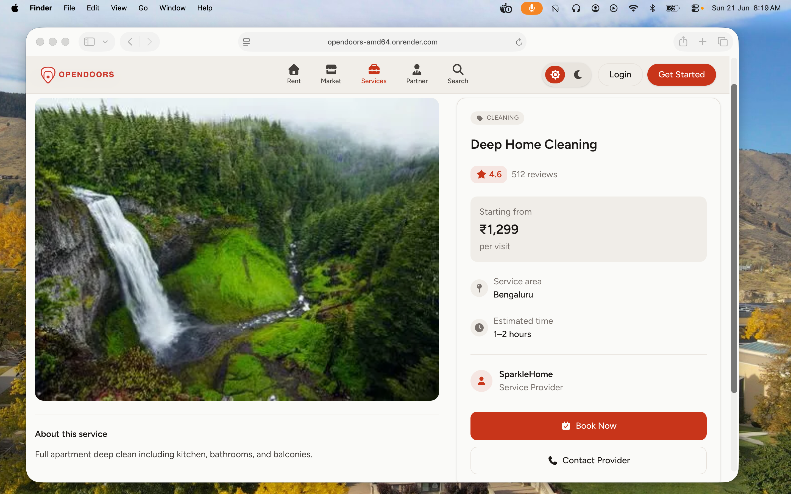
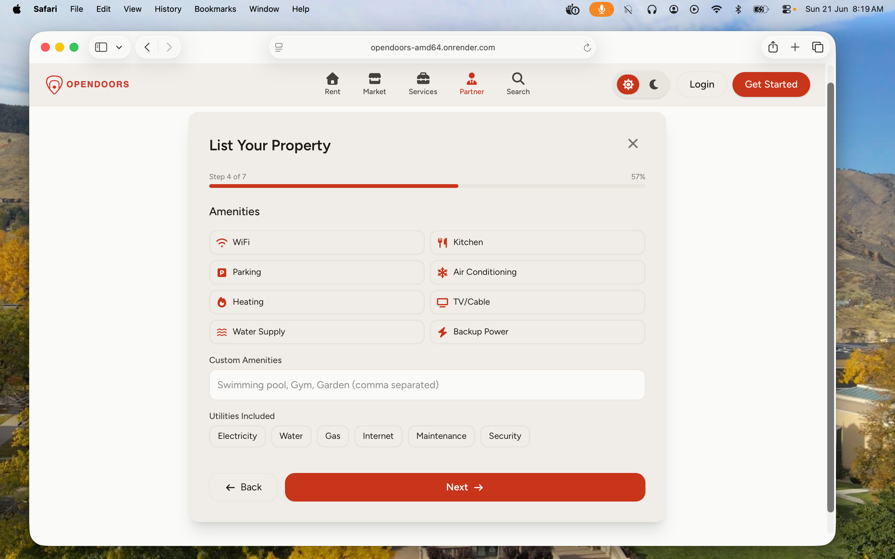
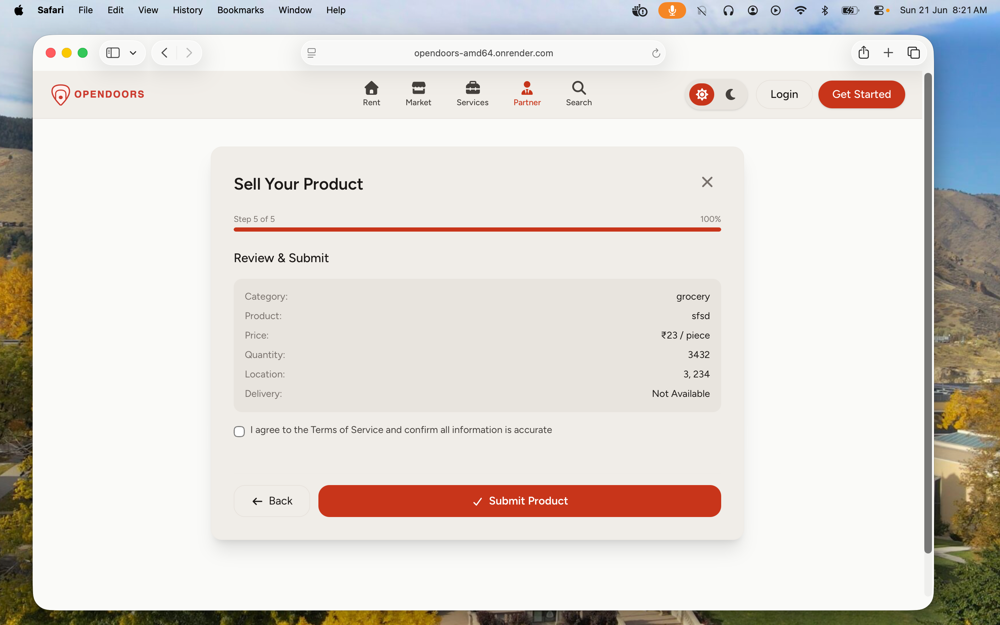
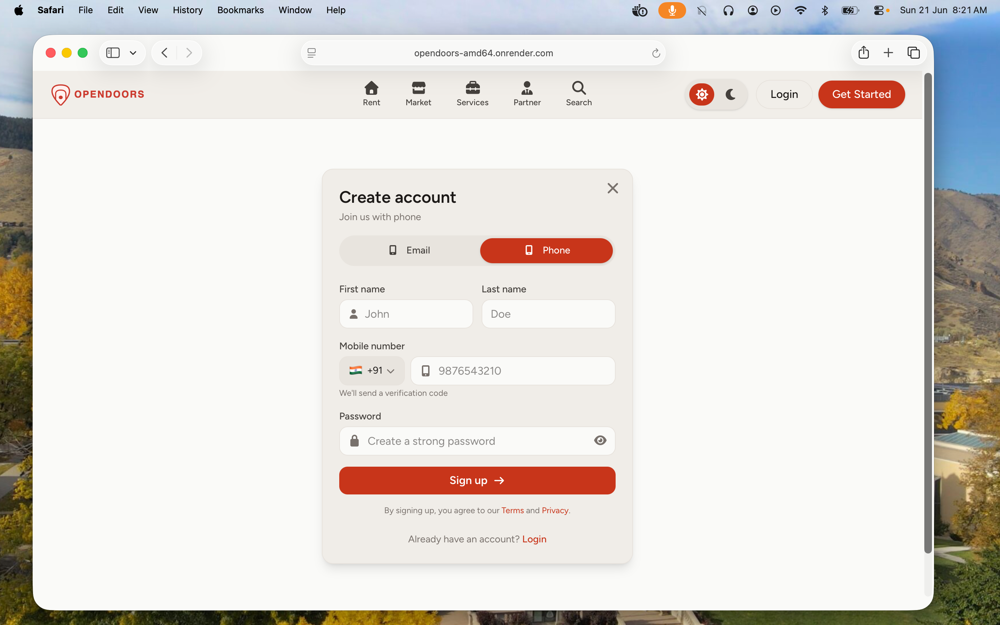

# OpenDoors

<div align="center">

A modern business platform distributed as pre-built Docker images for quick deployment and easy scaling.

[](https://hub.docker.com/r/cureerel/opendoors)
[]()

</div>

---

##  Features

| Feature | Description |
|---------|-------------|
|  **Dockerized** | Pre-built images for instant deployment |
| **Responsive** | Optimized for all screen sizes |
|  **Fast** | Built on Next.js for blazing performance |
|  **Scalable** | Easy horizontal scaling |
|  **Cloud Ready** | Deploy anywhere Docker runs |
|  **Low Maintenance** | Simple setup and updates |

---

##  Showcase

<table>
  <tr>
    <td></td>
    <td></td>
  </tr>
  <tr>
    <td></td>
    <td></td>
  </tr>
  <tr>
    <td></td>
    <td></td>
  </tr>
  <tr>
    <td></td>
    <td></td>
  </tr>
  <tr>
    <td></td>
    <td></td>
  </tr>
</table>

---

##  Docker Images

### amd64

> Recommended for VPS servers, Railway, AWS EC2, DigitalOcean, and most Linux servers.

```bash
docker pull cureerel/opendoors_amd64:latest
```

```bash
docker run -d -p 3000:3000 cureerel/opendoors_amd64:latest
```

### arm64

```bash
docker pull cureerel/opendoors:latest
```

```bash
docker run -d -p 3000:3000 cureerel/opendoors:latest
```

---

##  Quick Start

```bash
# Pull the image
docker pull cureerel/opendoors:latest

# Run the container
docker run -d \
  --name opendoors \
  -p 3000:3000 \
  --restart unless-stopped \
  cureerel/opendoors:latest
```

Open your browser:

```
http://localhost:3000
```

---

##  Deployment


Deploy on any platform that supports Docker containers:

- Railway
- AWS (ECS / EC2)
- DigitalOcean (App Platform / Droplets)
- Azure (Container Apps)
- Google Cloud (Cloud Run)
- Docker Desktop
- Self-hosted VPS
---

##  Built With


---

##  License

This project is provided as a Docker image for deployment and evaluation purposes.

---

<div align="center">

**Made by Cureerel**

</div>